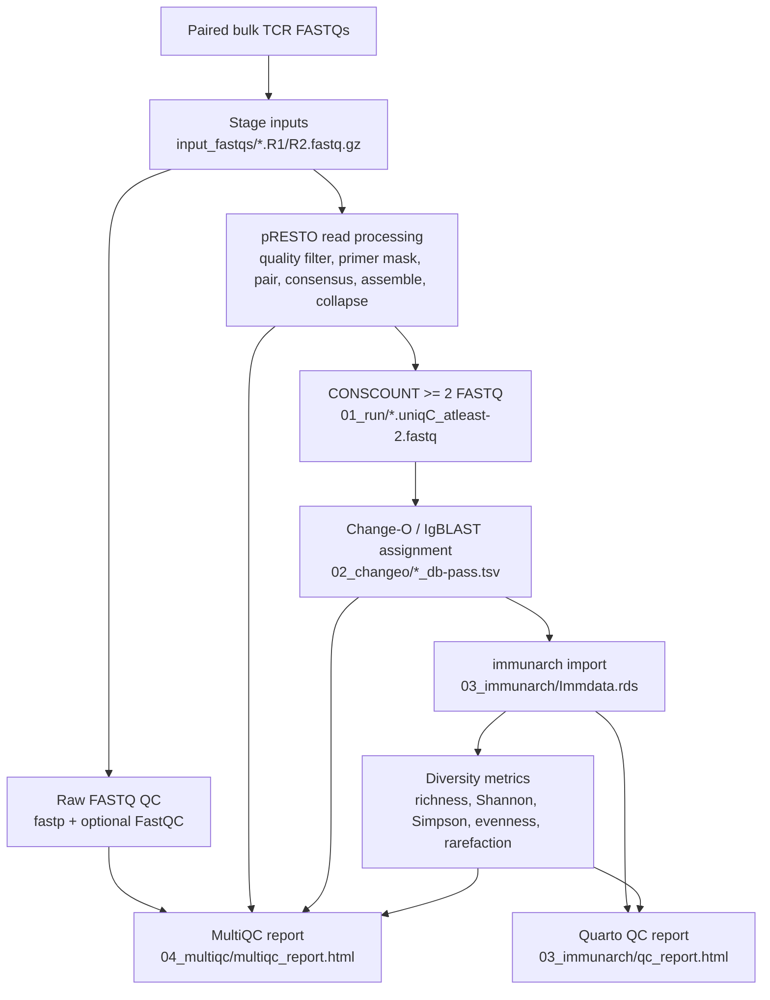

# tcr-seek

[](https://github.com/OpenOmics/tcr-seek/actions/workflows/docs.yml)
[](https://github.com/OpenOmics/tcr-seek/actions/workflows/tests.yml)
[](https://openomics.github.io/tcr-seek/)
[](https://github.com/OpenOmics/tcr-seek/issues)
[](https://github.com/OpenOmics/tcr-seek/blob/main/LICENSE)
[](https://hub.docker.com/r/pauls85/tcrseq-rnaseq)
[](https://doi.org/10.5281/zenodo.21908454)


`tcr-seek` is a reusable bulk TCR-seq pipeline skeleton modeled after the
command-oriented layout of OpenOmics `cell-seek`. It accepts paired FASTQ files,
runs the pRESTO processing method used in the existing `01_run` scripts, runs
Change-O/IgBLAST as in `02_changeo`, and creates an immunarch object from the
resulting AIRR tables.

## Pipeline DAG



## Method implemented in this directory

The pipeline performs six stages:

1. pRESTO read processing per sample: quality filtering, primer masking,
   read pairing, consensus building, pair assembly, C-region masking, header
   parsing, duplicate collapsing, and `CONSCOUNT >= 2` splitting.
2. Change-O/IgBLAST assignment: `changeo-igblast` converts each
   `*.uniqC_atleast-2.fastq` into AIRR-style `*_db-pass.tsv` output.
3. immunarch import: db-pass TSV files are copied into `03_immunarch/ImmunarchInput`,
   metadata are written, `immunarch::repLoad()` is called, and `Immdata.rds` is
   saved.
4. repertoire diversity metrics: the immunarch object is converted to a vegan
   community matrix using `strict` by default. The workflow
   writes the selected clonotype mode/definition, observed richness, Shannon diversity, vegan Simpson diversity
   `(1 - D)`, Pielou evenness, library size, rarefied richness, rarefaction
   curves, and the retained descriptive `RichnessPerMillion` value.
5. Quarto QC report: `qc_report.html` summarizes diversity metrics, library size, clone dominance, rarefaction curves, and user-selected sample metadata variables from `--qc-variables`.
6. Raw FASTQ QC: each sample gets upstream R1/R2 QC before pRESTO. The rule always writes a paired-end `fastp` report and also writes FastQC R1/R2 reports when `fastqc` is available in the runtime environment. These reports capture upstream sequencing metrics such as read counts, base quality, sequence length, adapter/overrepresented content where supported, duplication, and GC content.
7. MultiQC report: `multiqc_report.html` combines upstream QC with the real tcr-seek MultiQC plugin. When FastQC reports are present the report order is FastQC, tcr-seek, then fastp; otherwise it is fastp then tcr-seek. The custom tcr-seek section summarizes pRESTO processing counts, final `CONSCOUNT >= 2` recovery, Change-O/IgBLAST pass counts, productivity, in-frame status, stop codons, consensus-count summaries, and top V/J/locus calls, plus interpretation notes for duplication and GC in targeted bulk TCR-seq.

Rarefaction uses the minimum sample library size, calculated from total clonotype
abundance with `rowSums`, not the number of observed clonotypes. This matters
because `vegan::rarefy()` expects an abundance depth. `RichnessPerMillion` is
kept only as a rough descriptive metric: observed richness is nonlinear with
sequencing depth, so dividing richness by reads-per-million can over-correct
shallow libraries and under-correct deep libraries. Prefer rarefied richness,
coverage-aware estimators, or statistical models that include depth when making
comparisons across samples.

Raw FASTQ files are staged under `input_fastqs/` in the output directory, following the `cell-seek` convention of converting read suffixes to `.R1.fastq.gz` and `.R2.fastq.gz`. If more than one input FASTQ maps to the same sample and read through `--sample-fastq`, the runner writes one concatenated gzip FASTQ plus a `.sources.txt` manifest. Inputs with a single FASTQ for a sample/read are staged as symlinks. The source FASTQs are never decompressed or edited in place.

## Example

Run from inside the container/SIF that contains the required tools:

```bash
./tcr-seek run \
  --sample-fastq /path/to/sample_fastq.txt \
  --output /path/to/tcr_output \
  --refdir /path/to/01_ref \
  --metadata /path/to/metadata.txt \
  --sample-info /path/to/sample_info.tsv \
  --qc-variables Disease,Batch,Sex \
  --mixcr-license-file /path/to/mi.license \
  --threads 2 \
  --clonotype-definition strict \
  --cores 8
```

When running through Singularity on this filesystem, bind both `/data` and `/vf` because `/data/...` paths resolve through `/vf/users/...`:

```bash
singularity exec \
  --bind /data:/data \
  --bind /vf:/vf \
  --bind /tmp:/tmp \
  containers/tcrseq-rnaseq_1.3.sif \
  ./tcr-seek/tcr-seek run ...
```

The reference directory must contain:

- `IS_Human_R1_Primers.fasta`
- `IS_Human_R2_Primers.fasta`
- `IS_Human_C-Region.fasta`
- `Immune_Ref.fasta`

Outputs are written under the chosen output directory in `input_fastqs`,
`00_fastqc`, `01_run`, `02_changeo`, `03_immunarch`, and `04_multiqc` subdirectories. Diversity outputs are written inside `03_immunarch` as `diversity_summary.rds`, `rarefaction.rds`, `rarefaction_curve.rds`, and `DiversityMethod.txt`. Use `--run-rarefaction false` to skip rarefied richness and rarefaction-curve calculations while rendering the no-rarefaction QC report. The Quarto QC report is written as `03_immunarch/qc_report.html`. The separate MultiQC report is written as `04_multiqc/multiqc_report.html`, with raw QC outputs in `00_fastqc/<sample>/` and the parsed tcr-seek input table saved as `04_multiqc/tcr_seek_multiqc.tsv`.

## Slurm Mode

`tcr-seek` can run in `local` mode or `slurm` mode. Local mode is the default and is useful for testing or small runs from inside the SIF. Slurm mode is intended for full projects: Snakemake runs as a lightweight controller on the host, submits one job per runnable rule instance, and each worker job executes inside the configured SIF with `singularity exec`.

For Slurm mode, launch from the host login environment where `snakemake`, `singularity`, and `sbatch` are available. Like `cell-seek`, real Slurm runs submit a lightweight controller job and then return after printing the Slurm job id. The controller job runs Snakemake and submits worker jobs. Use `--no-submit-controller` only for foreground debugging.

Example Slurm dry-run:

```bash
module load snakemake singularity

./tcr-seek/tcr-seek run \
  --sample-fastq /path/to/sample_fastq.txt \
  --output /path/to/tcr_output \
  --refdir /path/to/01_ref \
  --threads 2 \
  --mode slurm \
  --container-image /data/NIAMS_IDSS/projects/NIAMS-47/containers/tcrseq-rnaseq_1.3.sif \
  --jobs 100 \
  --dry-run
```

Example Slurm dry-run using a shareable SIF cache:

```bash
module load snakemake singularity

./tcr-seek/tcr-seek run \
  --sample-fastq /path/to/sample_fastq.txt \
  --output /path/to/tcr_output \
  --refdir /path/to/01_ref \
  --threads 2 \
  --mode slurm \
  --sif-cache /data/NIAMS_SPA/processed/BulkTCR/containers \
  --jobs 100 \
  --dry-run
```

`--sif-cache` points to a directory containing the default tcr-seek SIF. If the
expected SIF is absent, `tcr-seek` pulls the default container URI recorded in
`config/containers.json` into that directory before writing the run `config.json`.
Use `tcr-seek cache --sif-cache /path/to/SIFs` to pre-populate the cache before
running, which is useful on clusters with limited external network access or
DockerHub rate limits. Use `--container-image /path/to/image.sif` when you want
to bypass the default cache resolver and pin an exact image path.

Dry-runs print the Snakemake plan to the terminal and also write it to `<output>/logfiles/dry-run.log`; add `--quiet` to write only the log file. Remove `--dry-run` to submit the controller job. `--threads` controls CPUs requested for each per-sample pRESTO and Change-O job. `--jobs` controls how many Slurm jobs Snakemake may have active at once. Default worker resources are currently `32 GB / 1 day` for pRESTO, `16 GB / 8 hours` for Change-O/IgBLAST, `100 GB / 3 days` for immunarch object creation, `100 GB / 4 hours` for repertoire diversity, `16 GB / 4 hours` for the Quarto QC report, and `8 GB / 1 hour` for MultiQC.

## FASTQ Parsing

`tcr-seek` follows the `cell-seek` input convention: input FASTQs are normalized
to symlinks named `sample.R1.fastq.gz` and `sample.R2.fastq.gz` before sample
discovery. The staged symlink keeps demultiplexing tokens such as `_S1`, then
sample discovery strips those tokens from the analysis sample name. For example,
`SpA00001_S1_R1_001.fastq.gz` is staged as `SpA00001_S1.R1.fastq.gz`, and the
analysis sample name becomes `SpA00001`. Likewise, `82C_S47_R1_001.fastq.gz` is
staged as `82C_S47.R1.fastq.gz`, and the analysis sample name becomes `82C`.

## Sample Map

By default, `tcr-seek` keeps the current automatic sample naming behavior: it
uses the first part of the FASTQ name after stripping Illumina `_S##` and read
suffixes. For manual control, pass `--sample-map sample_map.tsv`. For report grouping variables, pass `--sample-info sample_info.tsv`; the file must contain `Sample`, `SampleID`, `sample`, or `sample_id` plus any sample annotations such as disease, batch, sex, age group, or sequencing center. Columns from this file are merged into `immdata` and the written `ImmunarchInput/metadata.txt`. Use `--qc-variables Disease,Batch,Sex` to choose which merged variables get QC report tabs; if omitted, all non-`Sample` metadata columns are used.

The sample-map TSV must
contain `fastq` and `sample` columns. The `fastq` value can be a full path or a
FASTQ basename. FASTQs listed in the map use the provided sample name; unlisted
FASTQs continue to use automatic parsing. The same two-column table can be passed
as `--sample-fastq`; in that mode `tcr-seek` reads the FASTQ inputs from the
`fastq` column and also uses the table as the sample map unless a separate
`--sample-map` is supplied.

Example:

```text
fastq	sample
SpA00001_S1_R1_001.fastq.gz	Patient001_baseline
SpA00001_S1_R2_001.fastq.gz	Patient001_baseline
82C_S47_R1_001.fastq.gz	Control_82C
82C_S47_R2_001.fastq.gz	Control_82C
```

## MiXCR license

MiXCR is installed in the container, but it requires a license before MiXCR-based
rules can run. Put the license text in `config/mi.license`, or pass another file
with `--mixcr-license-file /path/to/mi.license`. When a non-empty license file is
found, `tcr-seek` sets `MI_LICENSE_FILE` for the Snakemake run. The current
pRESTO, Change-O, and immunarch stages do not call MiXCR yet.
